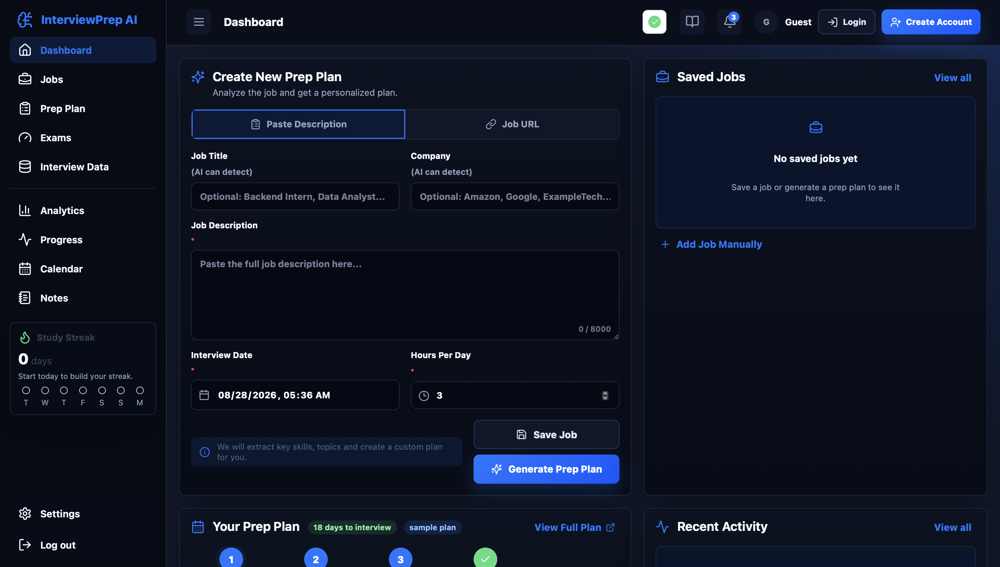

<h1 align="center">InterviewPrep AI</h1>

<p align="center"><strong>An AI-powered job-to-interview workspace for personalized prep plans, study notes, exams, mock interviews, and readiness tracking.</strong></p>

<p align="center">
  <a href="https://prepinterviewai.com/"><strong>▶ OPEN THE LIVE APP</strong></a>
  &nbsp;•&nbsp;
  <a href="#from-job-posting-to-interview-readiness">Product workflow</a>
  &nbsp;•&nbsp;
  <a href="#system-architecture">Architecture</a>
  &nbsp;•&nbsp;
  <a href="#run-locally">Run locally</a>
</p>

<p align="center">
  
  
  
  
  
  
</p>

<p align="center">
  <a href="https://prepinterviewai.com/">
    
  </a>
</p>

InterviewPrep AI is a deployed full-stack SaaS-style product that turns a target job into an organized interview-preparation workspace. It combines authenticated user data, AI generation, research enrichment, structured practice, and progress tools in one responsive web application.

## From Job Posting to Interview Readiness

| 1. Capture the role | 2. Build the plan | 3. Learn and practice | 4. Track readiness |
| --- | --- | --- | --- |
| Paste a job description, submit a URL, add a role manually, or capture it with the Chrome extension. | AI identifies the role and company, analyzes requirements, and distributes preparation across the days before the interview. | Generate detailed notes, retain Ask AI conversations, take configurable exams, and practice voice-enabled mock interviews. | Use saved jobs, calendar workflows, progress views, analytics, activity history, and study streaks to stay organized. |

## Product Highlights

- **Job-aware preparation:** analyzes a complete posting and creates a role-specific day-by-day plan.
- **Persistent AI notes:** generates structured study material with examples, interview explanations, deeper learning, and saved follow-up Q&A.
- **Configurable exams:** supports difficulty presets, question counts, timing, multiple question types, scoring, and detailed review.
- **Mock interview practice:** generates role-relevant rounds with read-aloud questions, timing, scoring, and later review.
- **Preparation workspace:** connects saved jobs, plans, notes, exams, calendar events, progress, analytics, and recent activity.
- **Production authentication:** uses JWT sessions, registration OTP, password-reset OTP, user-scoped records, and account controls.
- **Browser capture:** includes a Chrome extension for saving job URLs and descriptions from external job sites.
- **Operational visibility:** includes a protected developer dashboard for usage and provider-health monitoring.

## System Architecture

```text
React 19 + Vite 7 frontend (Vercel)
                  |
                  | HTTPS / REST / JWT
                  v
FastAPI + SQLAlchemy API (Render)
       |                |                 |
       v                v                 v
PostgreSQL/Neon    OpenAI + Tavily     Resend email

Chrome extension -> job capture -> authenticated API
```

The backend owns authentication, user-scoped persistence, job analysis, plan generation, notes, exams, mock interviews, progress, calendar data, and administrative usage reporting. Alembic manages database migrations, while the frontend communicates with the API through authenticated REST requests.

## Technical Stack

| Layer | Technology | Responsibility |
| --- | --- | --- |
| Frontend | React 19, Vite 7, JavaScript, CSS | Responsive dashboard, forms, notes, exams, interviews, calendar, analytics, and settings |
| Backend | Python, FastAPI, Pydantic, SQLAlchemy, Alembic | REST APIs, business logic, validation, persistence, migrations, and AI orchestration |
| Database | PostgreSQL on Neon | Authenticated, per-user jobs, plans, notes, attempts, progress, and application records |
| AI and research | OpenAI APIs, Tavily | Job analysis, preparation plans, teaching content, questions, feedback, and research enrichment |
| Authentication and email | JWT, Resend OTP | Registration verification, password recovery, sessions, and account security |
| Deployment | Vercel, Render, Neon | Production frontend, API service, and managed PostgreSQL infrastructure |
| Companion client | Chrome extension | Job URL and description capture from external sites |
| Quality | pytest, API regression tests, Vite production build | Backend behavior and deployable frontend verification |

## Repository Structure

```text
InterviewPrep AI/
  backend/             FastAPI API, models, services, migrations, and tests
  frontend/            React/Vite web application
  browser-extension/   Chrome extension for job capture
  docs/                architecture, deployment, and project handoff notes
  tools/               documentation support scripts
  RUN_LOCALLY.md       complete local setup guide
```

## Run Locally

Follow [RUN_LOCALLY.md](RUN_LOCALLY.md) for environment variables and complete setup instructions.

```bash
# Backend
cd backend
python3 -m venv .venv
source .venv/bin/activate
pip install -e ".[dev]"
uvicorn app.main:app --reload --host 127.0.0.1 --port 8000

# Frontend (new terminal)
cd frontend
npm install
npm run dev
```

## Validate the Project

```bash
# Backend
cd backend
source .venv/bin/activate
pytest

# Frontend
cd frontend
npm run build
```

## Product Analytics Case Study

[View the Tableau product-analytics experience](https://public.tableau.com/app/profile/shashank.pabitwar/viz/PrepInterview_AI_Product_Analytics_Scroll_Final/PrepInterviewAIScrollExperience).

The Tableau portfolio analysis is built from explicitly synthetic users and events. It demonstrates event modeling, funnels, cohorts, retention, learning outcomes, and AI-reliability metrics; it does not represent InterviewPrep AI production traffic or customer outcomes.

## Documentation

- [Project memory and technical handoff](docs/project-memory.md)
- [Deployment and database plan](docs/deployment-and-database-plan.md)
- [Local development guide](RUN_LOCALLY.md)
